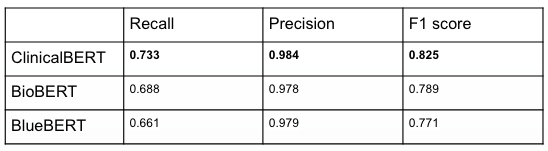
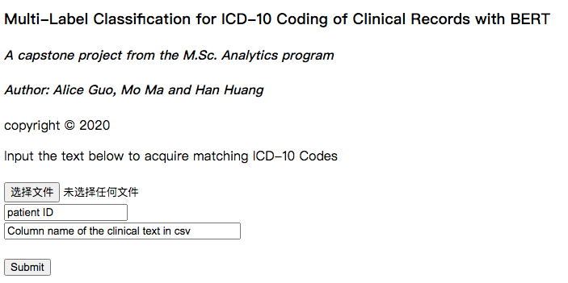
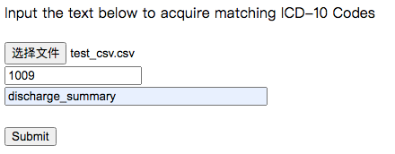
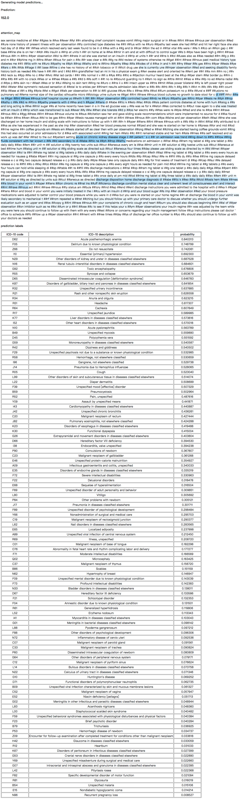

# Multi-Label Classification for ICD-10 Coding of Clinical Records with BERT
This is a University of Chicago Master of Science in Analytics Capstone Project presented in Fall 2020: **Multi-Label Classification for ICD-10 Coding of Clinical Records with BERT**. Our training data is [MIMIC-3 database](https://mimic.physionet.org/). This is a pytorch implementation of **H**ierarchical **N**etwork with **A**ttention architecture [(Yang et al, 2016)](http://www.cs.cmu.edu/~./hovy/papers/16HLT-hierarchical-attention-networks.pdf), and comes with a web for easily interacting with the trained models. 
### Get Started
In order to run the model, besides clone this github folder, you need your trained model's parameter file saved as model.pkl, and you need a pre-trained BERT parameter folder, either Clinical BERT, BioBERT or BlueBERT. The clinical BERT will give you the best result, based on precision, recall, and F-1 score. This is our test result from three pre-trained BERT above: 



After running the app.py file,

```python
python app.py
```
you will get a link of a website, after opening the link, you will see the website like this:



You can upload a csv file, in this csv file, it requires that the first column is called "HADM_ID", which stands for hospital administration ID, and one of the columns in this csv need to contain the clinical note that you want to analyze. You need to type the HADM_ID for a specific patient and the column name of the clinical note in that csv as inputs. For instance, like this:



Then you click submit button, then it will give you the prediction, which contains **number of ICD-10 code predicted**, **attention map**, **table containing ICD-10 code, ICD-10 code description, probability score**. The output would be like the following:



The attention map highlights the sentences and words with high attention score, which can show the importance of sentences in the clinical note. The predicted ICD-10 codes are sorted in descending order.
